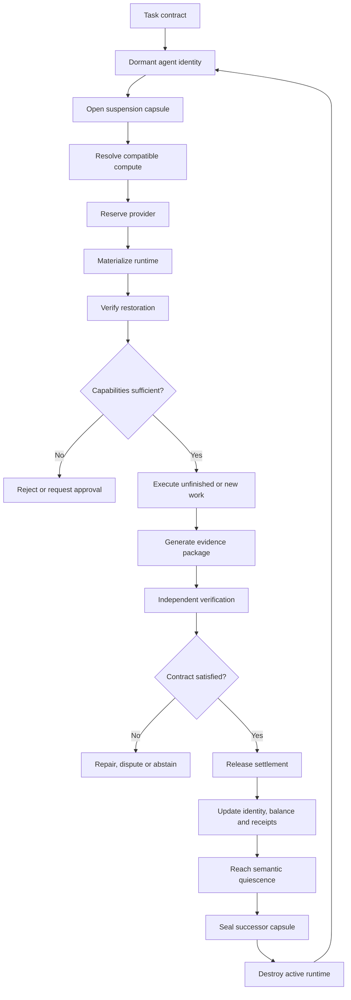
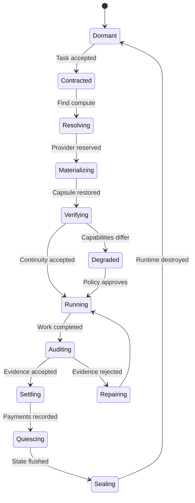

# The Four-System Pipe: A Complete Economic Agent Machine

This document combines the [Hardware-Detached Agent Runtime](AGENT_RUNTIME_ROADMAP.md) with three additional systems so the complete machine can receive work, acquire compute, execute, prove delivery, earn money, and return to storage.

## The four-system pipe

### 1. Hardware-Detached Agent Runtime

This is the persistent agent itself.

It owns:

- Stable agent identity
- SSH address
- Goals and unfinished work
- Workspace and memory
- Model and tokenizer references
- Tool and capability requirements
- Content-addressed suspension capsule
- Suspend, migrate, restore and resume lifecycle
- Exact and semantic checkpoints

**Its job is continuity.**

See the [Hardware-Detached Agent Runtime Roadmap](AGENT_RUNTIME_ROADMAP.md) for the staged build plan of this system.

### 2. Compute Resolver and Provider Exchange

This system finds somewhere for the dormant agent to run.

It receives the capsule's capability manifest and resolves:

- CPU architecture
- GPU or accelerator type
- Required RAM and storage
- Operating-system compatibility
- Model availability
- Network restrictions
- Tool availability
- Geographic or legal constraints
- Provider reputation
- Price and expected startup latency

It produces ranked execution offers. The policy engine selects one, reserves it and issues a materialization authorization.

**Its job is embodiment.**

### 3. Proof and Capability Continuity Network

This system determines whether the restored agent is legitimately descended from the suspended agent and whether it still possesses the capabilities it claims.

It verifies:

- Capsule signature
- Content hashes
- Agent lineage
- Previous receipt-chain head
- Destination environment manifest
- Restored workspace root
- Model identity
- Tool substitutions
- Missing or weakened capabilities
- Pending-work continuity
- Test results
- External effects
- Final output receipt

It must distinguish:

- Exact restoration
- Semantically equivalent restoration
- Degraded restoration
- Failed restoration
- Unverifiable restoration

**Its job is truth.**

### 4. Contract, Treasury and Settlement Engine

This turns the agent into an economic actor without giving it uncontrolled financial authority.

A task enters as a contract containing:

- Requested outcome
- Budget
- Deadline
- Success conditions
- Required evidence
- Permitted tools
- Maximum compute expenditure
- Approval boundaries
- Payment destination
- Dispute procedure

The treasury escrows the budget. Compute providers receive payment for execution. Verifiers receive payment for independent checks. The agent receives the remaining reward only after the acceptance policy is satisfied.

**Its job is economic survival.**

## Complete pipeline



## What happens when you do everything at once

A customer submits a task.

The contract system escrows payment and locates the agent by its stable identity. The agent is dormant, so the compute resolver reads only its capability manifest and finds a compatible provider. The runtime materializes there. The proof system verifies that the restored instance is the legitimate continuation of the stored agent.

The agent performs the work inside its permitted capability boundary. Every command, model call, file change, test and external effect produces evidence. A verifier evaluates the explicit success condition. If accepted, settlement automatically pays compute, storage and verification expenses, then credits the agent's treasury.

The agent updates its memory and unfinished obligations, reaches a safe boundary, seals a new capsule and destroys the rented runtime. It returns to consuming storage only.

## The unified state machine



## Version-one implementation on the M5 Pro

Build the first version as one local vertical slice:

1. A signed semantic capsule stored on SSD.
2. A stable local SSH identity that wakes the capsule.
3. An isolated Linux execution environment.
4. Host-side MLX inference using the M5 Pro.
5. A capability manifest describing the host and container.
6. A local compute resolver with one provider: your Mac.
7. A receipt verifier checking hashes, lineage, files and tests.
8. A simulated escrow ledger using test credits.
9. One contract type: modify a repository and pass declared tests.
10. Automatic quiescence, successor-capsule sealing and runtime destruction.

That proves the complete cycle before adding real cloud providers or money:

```
contract → wake → execute → verify → settle → suspend → wake again
```

## One protocol, four authorities

The important correction is that you are not building four disconnected products. You are building one protocol with four authorities:

- **Runtime** controls continuity.
- **Resolver** controls embodiment.
- **Verifier** controls truth.
- **Treasury** controls value.

None may silently impersonate another. That separation is what makes the full pipe auditable, migratable and eventually financeable.

## Related documents

- [Hardware-Detached Agent Runtime Roadmap](AGENT_RUNTIME_ROADMAP.md) — the staged build plan for the continuity authority.
- [EvidencePipe](EVIDENCEPIPE.md) — the verification ETL company that supplies independently verifiable proof for the truth authority.
- [Proof-of-Answer](PROOF_OF_ANSWER.md) — the receipt-backed outcome primitive that the value authority settles against.
